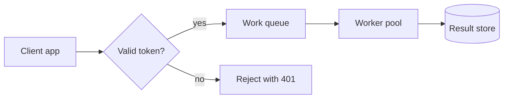
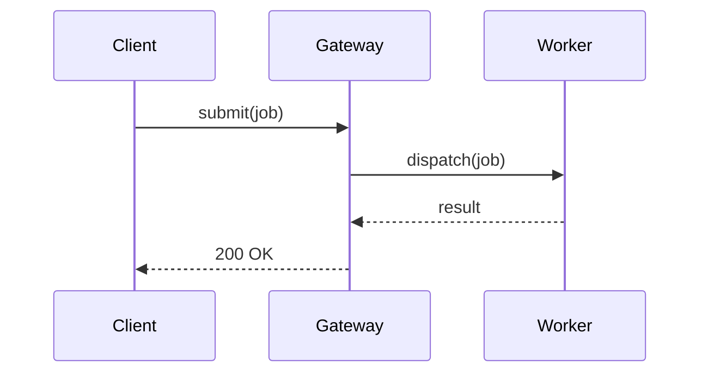
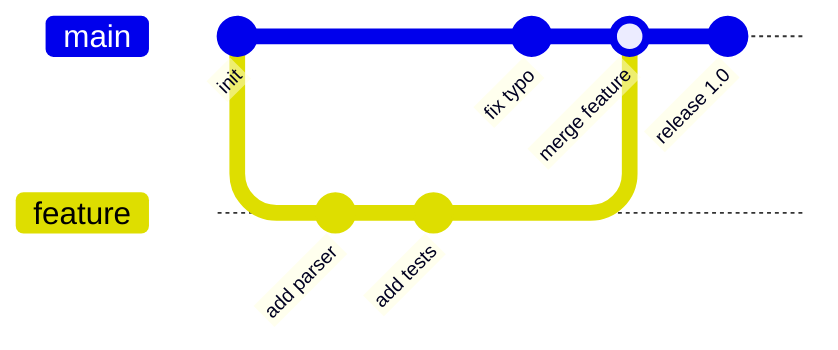

# Request Lifecycle

Every name in this file is made up.

```mermaid
flowchart LR
    Client[Client app] --> Gate{Valid token?}
    Gate -->|yes| Queue[Work queue]
    Gate -->|no| Reject[Reject with 401]
    Queue --> Worker[Worker pool]
    Worker --> Store[(Result store)]
```

```mermaid
sequenceDiagram
    participant Client
    participant Gateway
    participant Worker
    Client->>Gateway: submit(job)
    Gateway->>Worker: dispatch(job)
    Worker-->>Gateway: result
    Gateway-->>Client: 200 OK
```

```mermaid
gitGraph
    commit id: "init"
    branch feature
    commit id: "add parser"
    commit id: "add tests"
    checkout main
    commit id: "fix typo"
    merge feature id: "merge feature"
    commit id: "release 1.0"
```
